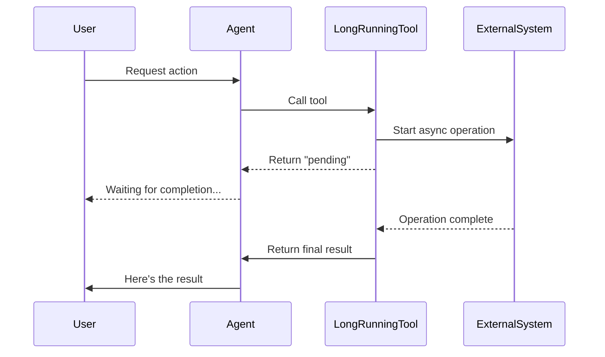

# ADK Workflow: Long-Running Function Tools

This workflow guides you through implementing tools for operations that take significant time to complete, such as human-in-the-loop approvals, external API calls, or background processing.

---

## Prerequisites

- [ ] ADK project initialized (`/adk-init`)
- [ ] Agent created (`/adk-agents-create`)
- [ ] Understanding of `FunctionTool` basics (`/adk-tools-function`)
- [ ] Required imports:

```python
from google.adk.tools import LongRunningFunctionTool
from google.adk.agents import LlmAgent
from google.adk.runners import Runner
from google.adk.events import Event
from google.genai import types
```

---

## Step 1: Understand the Long-Running Pattern

`LongRunningFunctionTool` is designed for operations that:

- Take significant time to complete (seconds to minutes)
- Require human approval or input
- Depend on external systems with unpredictable latency
- Need to be processed outside the agent workflow

### How It Works



---

## Step 2: Define the Long-Running Function

Your function returns `None` initially to indicate "pending", then the final result when complete:

```python
def request_human_approval(
    action: str,
    details: str
) -> dict | None:
    """Requests human approval for a sensitive action.
    
    This function initiates a human approval workflow. The result
    will be provided asynchronously once a human approves or denies.
    
    Args:
        action: The action requiring approval (e.g., "delete_account").
        details: Additional context for the approver.
    
    Returns:
        None while pending, or dict with approval status when complete.
    """
    # Create a ticket/request in your approval system
    ticket_id = create_approval_ticket(action, details)
    
    # Return None to indicate "pending" - agent will wait
    return None
```

> [!IMPORTANT]
> When your function returns `None`, the framework understands the operation is pending and will not treat it as complete.

---

## Step 3: Wrap with LongRunningFunctionTool

```python
from google.adk.tools import LongRunningFunctionTool

# Wrap your function
approval_tool = LongRunningFunctionTool(func=request_human_approval)

# Add to agent
root_agent = LlmAgent(
    name="approval_agent",
    model="gemini-2.0-flash",
    instruction="You help users with actions that require approval.",
    tools=[approval_tool]
)
```

---

## Step 4: Handle Async Events in Client Code

The agent client must listen for long-running function call events and send updates:

```python
from google.adk.runners import Runner
from google.adk.sessions import InMemorySessionService
from google.adk.events import Event
from google.genai import types

async def run_agent_with_long_running_tools(user_query: str):
    runner = Runner(
        agent=root_agent,
        app_name="approval_app",
        session_service=InMemorySessionService()
    )
    
    session = await runner.session_service.create_session(
        app_name="approval_app",
        user_id="user123"
    )
    
    content = types.Content(
        role="user",
        parts=[types.Part.from_text(user_query)]
    )
    
    # Run the agent and process events
    async for event in runner.run_async(
        user_id="user123",
        session_id=session.id,
        new_message=content
    ):
        # Check for long-running function calls
        if event.long_running_tool_ids:
            # Handle the pending operation
            await handle_pending_operations(runner, event, session)
```

---

## Step 5: Send Intermediate/Final Results

Once the external operation completes, send the result back:

```python
async def handle_pending_operations(runner, event, session):
    """Process pending long-running operations."""
    
    for function_call_id in event.long_running_tool_ids:
        # Wait for external system (e.g., poll approval system)
        approval_result = await poll_approval_system(function_call_id)
        
        if approval_result.status == "approved":
            # Send final result
            response_content = types.Content(
                role="user",
                parts=[types.Part.from_function_response(
                    name="request_human_approval",
                    response={
                        "status": "approved",
                        "approved_by": approval_result.approver,
                        "timestamp": approval_result.timestamp
                    }
                )]
            )
        elif approval_result.status == "denied":
            response_content = types.Content(
                role="user",
                parts=[types.Part.from_function_response(
                    name="request_human_approval",
                    response={
                        "status": "denied",
                        "reason": approval_result.reason
                    }
                )]
            )
        else:
            # Send intermediate update (still pending)
            response_content = types.Content(
                role="user",
                parts=[types.Part.from_function_response(
                    name="request_human_approval",
                    response={
                        "status": "pending",
                        "message": "Waiting for approver..."
                    }
                )]
            )
        
        # Resume the agent with the response
        async for event in runner.run_async(
            user_id="user123",
            session_id=session.id,
            new_message=response_content
        ):
            # Process subsequent events
            yield event
```

---

## Step 6: Complete Example - Human-in-the-Loop

```python
from google.adk.agents import LlmAgent
from google.adk.tools import LongRunningFunctionTool
from google.adk.runners import Runner
from google.adk.sessions import InMemorySessionService
from google.genai import types

# 1. Define the long-running function
def request_approval(
    action_type: str,
    resource_id: str,
    reason: str
) -> dict | None:
    """Request human approval for a sensitive action.
    
    Args:
        action_type: Type of action (delete, modify, transfer).
        resource_id: ID of the resource being acted upon.
        reason: Justification for the action.
    
    Returns:
        Approval decision when complete, None while pending.
    """
    # In real implementation: create ticket in approval system
    print(f"Approval requested: {action_type} on {resource_id}")
    return None  # Pending

# 2. Create the tool and agent
approval_tool = LongRunningFunctionTool(func=request_approval)

agent = LlmAgent(
    name="secure_action_agent",
    model="gemini-2.0-flash",
    instruction="""You help users perform secure actions.
    Always use request_approval for delete or modify operations.
    Wait for approval before confirming the action is complete.""",
    tools=[approval_tool]
)

# 3. Client code to handle the workflow
async def main():
    runner = Runner(
        agent=agent,
        app_name="secure_app",
        session_service=InMemorySessionService()
    )
    
    session = await runner.session_service.create_session(
        app_name="secure_app",
        user_id="user1"
    )
    
    # User requests a deletion
    user_msg = types.Content(
        role="user",
        parts=[types.Part.from_text("Delete my account")]
    )
    
    async for event in runner.run_async(
        user_id="user1",
        session_id=session.id,
        new_message=user_msg
    ):
        if event.long_running_tool_ids:
            print("Waiting for human approval...")
            
            # Simulate getting approval (in real app: wait for webhook/poll)
            await asyncio.sleep(2)
            
            # Send approval result
            approval_response = types.Content(
                role="user",
                parts=[types.Part.from_function_response(
                    name="request_approval",
                    response={"status": "approved", "approver": "admin@example.com"}
                )]
            )
            
            async for final_event in runner.run_async(
                user_id="user1",
                session_id=session.id,
                new_message=approval_response
            ):
                if final_event.content and final_event.content.parts:
                    for part in final_event.content.parts:
                        if part.text:
                            print(f"Agent: {part.text}")
```

---

## Configuration Options

### LongRunningFunctionTool Constructor

| Parameter | Type | Default | Description |
|-----------|------|---------|-------------|
| `func` | `Callable` | Required | Function that returns `None` when pending |
| `name` | `str` | Function name | Override tool name |
| `description` | `str` | From docstring | Override description |

### Event Attributes for Long-Running Tools

| Attribute | Type | Description |
|-----------|------|-------------|
| `long_running_tool_ids` | `list[str]` | IDs of pending tool calls |
| `actions.skip_summarization` | `bool` | Skip LLM summarization while waiting |

---

## Integration Points

- **With Callbacks:** Use `before_tool_callback` to validate inputs before starting long operations
- **With State:** Store operation IDs in `tool_context.state` for tracking
- **With Streaming:** Works with `run_live()` for real-time updates
- **With Session:** Operation state persists in session for resumption

---

## Common Patterns

### Pattern 1: Timeout with Fallback

```python
import asyncio

async def handle_with_timeout(runner, event, session, timeout_seconds=300):
    """Handle long-running operation with timeout."""
    try:
        result = await asyncio.wait_for(
            poll_for_completion(event.long_running_tool_ids[0]),
            timeout=timeout_seconds
        )
        return result
    except asyncio.TimeoutError:
        # Send timeout response
        return {"status": "timeout", "message": "Operation timed out"}
```

### Pattern 2: Progress Updates

```python
async def send_progress_update(runner, session, tool_name, progress_pct):
    """Send intermediate progress update."""
    progress_content = types.Content(
        role="user",
        parts=[types.Part.from_function_response(
            name=tool_name,
            response={
                "status": "in_progress",
                "progress": progress_pct,
                "message": f"Processing... {progress_pct}% complete"
            }
        )]
    )
    async for event in runner.run_async(
        user_id="user1",
        session_id=session.id,
        new_message=progress_content
    ):
        pass  # Process events
```

### Pattern 3: Webhook-Based Completion

```python
from fastapi import FastAPI, Request

app = FastAPI()

# Store pending operations
pending_operations = {}

@app.post("/webhook/approval/{operation_id}")
async def approval_webhook(operation_id: str, request: Request):
    """Receive approval webhook and resume agent."""
    data = await request.json()
    if operation_id in pending_operations:
        runner, session = pending_operations[operation_id]
        # Resume agent with result
        await resume_agent(runner, session, data)
```

---

## Verification

```bash
# Run the agent
adk web agent_folder
```

**Expected Behavior:**
1. Agent calls the long-running tool
2. Event contains `long_running_tool_ids`
3. Agent message indicates waiting
4. After sending result, agent processes and responds

### Verification Checklist

- [ ] Function returns `None` for pending state
- [ ] Tool wrapped with `LongRunningFunctionTool`
- [ ] Client code checks `event.long_running_tool_ids`
- [ ] Function response sent with correct tool name
- [ ] Agent continues after receiving result

---

## Troubleshooting

| Issue | Cause | Solution |
|-------|-------|----------|
| Agent doesn't wait | Function not returning `None` | Ensure `return None` for pending state |
| Duplicate responses | Sending result multiple times | Track processed operation IDs |
| Session lost | Not persisting session | Use persistent `SessionService` |
| Wrong tool receives response | Mismatched function name | Verify `name` in `from_function_response` |
| Timeout errors | External system slow | Implement timeout handling pattern |

---

## References

- Long-Running Tools Guide: `docs/tools-custom/function-tools.md#long-run-tool`
- Event Handling: `docs/runtime/index.md`
- Streaming Integration: `docs/streaming/dev-guide/part3.md`
- Runner API: `src/google/adk/runners/runner.py`
